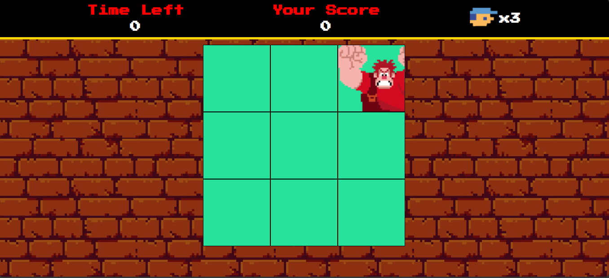

# Detona Ralph Game

Criação do jogo do Detona Ralph utilizando conceitos do JavaScript, na realização do
desafio de projeto da DIO

## Ferramentas Utilizadas

- HTML
- CSS
- JavaScript (conceitos de variáveis do tipo View e Values)

Coded by Bruno Mazeto 😎
